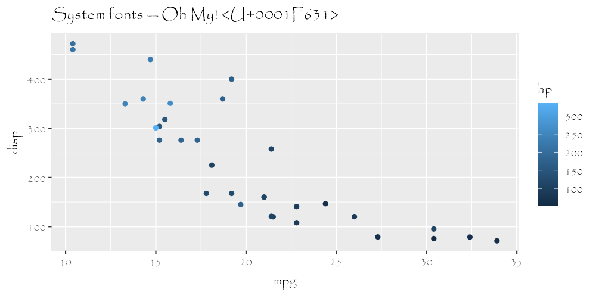

<!-- README.md is generated from README.Rmd. Please edit that file -->

# repro\_workshop

<!-- badges: start -->
<!-- badges: end -->

The goal of repro\_workshop is to …

What is special about using `README.Rmd` instead of just `README.md`?
You can include R chunks like so:

<!--```{r noresults, results='hide'}
--stop("Figure me out.")
--``` -->

``` r
slow_square <- function(x){
Sys.sleep(5)
x * x
}
slow_square(4)
#> [1] 16
```

``` r
library(ragg)
library(ggplot2)

file <- knitr::fig_path('.png')

on_linux <- tolower(Sys.info()[['sysname']]) == 'linux'
fancy_font <- if (on_linux) 'URW Chancery L' else 'Papyrus'

agg_png(file, width = 1000, height = 500, res = 144)
ggplot(mtcars) + 
  geom_point(aes(mpg, disp, colour = hp)) + 
  labs(title = 'System fonts — Oh My! 😱') + 
  theme(text = element_text(family = fancy_font))
invisible(dev.off())

knitr::include_graphics(file)
```



You’ll still need to render `README.Rmd` regularly, to keep `README.md`
up-to-date. `devtools::build_readme()` is handy for this. You could also
use GitHub Actions to re-render `README.Rmd` every time you push. An
example workflow can be found here:
<https://github.com/r-lib/actions/tree/master/examples>.

In that case, don’t forget to commit and push the resulting figure
files, so they display on GitHub.
